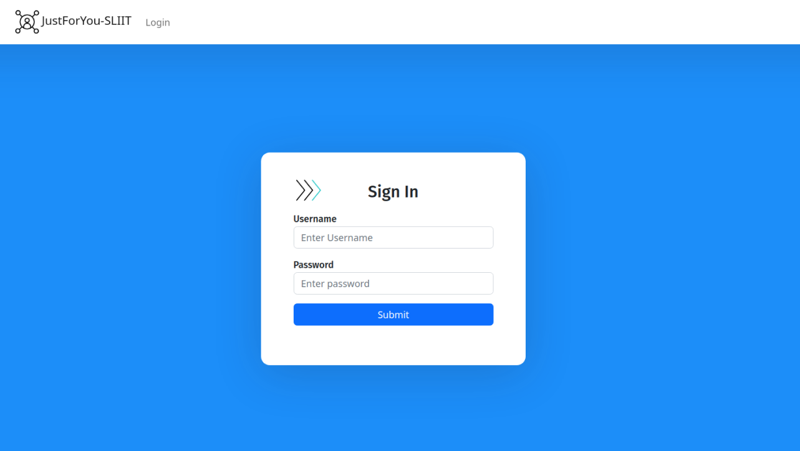
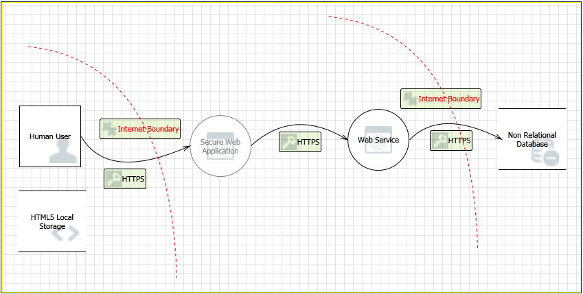

## Secure Software Development - React / Node Application

### **Introduction**

This is the report based on the development assignment of Secure software engineering. Both client and the backend of the project is developed using NodeJS. In terms of the functionality software allows two users to interact with the database, who are admins, managers, and workers. Each of these users have their own level access implemented with role base access control. Access is given to admins to create either managers or workers, then workers will have access only to save messages whereas managers will have access to both save messages and upload images to the database.

### **Threat Model**

### **Development Team**

🧑 Anawaratne M.A.N.A. - IT19086408@my.sliit.lk

🧑 Wangchen T. - IT19098838@my.sliit.lk